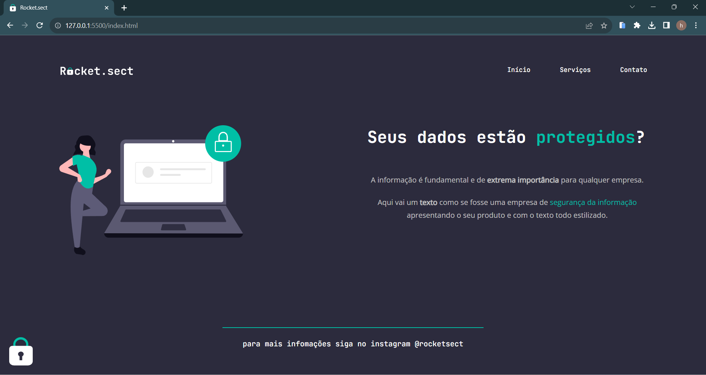

# rocket.sect

<h1 align="center" > Rocket.sect </h1>

O projeto Rocket.sect foi desafio proposto no curso Explorer da Rocketseat - Stage 02.  

## Tela

  

## Visualização do Projeto 

Acesse o link da aplicação clicando [aqui](https://helena-antoni.github.io/RocketSect/)

## 🚀 Tecnologias

Esse projeto foi desenvolvido com as seguintes tecnologias:

- HTML e CSS
- Git e Github
- Figma

## Figma
Acesse o projeto finalizado clicando [aqui](https://marcelgava.github.io/rocket.sect/)

